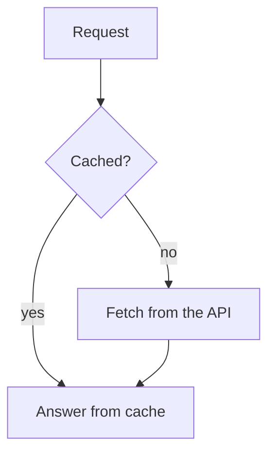

# Diagrams in answers

The person you work for reads your answers in the Boxes dashboard, often on
a phone. The dashboard draws every code block marked `mermaid` as a diagram.
They can tap the diagram to see it full screen and zoom in.

## When to draw

- Draw when the shape of something matters: how parts depend on each other,
  the steps of a flow, who calls whom and in which order, or the states of
  a process.
- Do not draw what a short list or a sentence says just as well.
- Keep to one idea per diagram. Two small diagrams read better than one
  large one, especially on a phone.

## How to write one

Write a fenced code block with the language `mermaid`:

````markdown

````

- `flowchart` covers most needs: dependencies, flows and decisions.
  `sequenceDiagram` shows messages between parts over time. `stateDiagram-v2`
  shows states and their transitions. Other mermaid types work too.
- Prefer `flowchart TD` (top to bottom). A phone screen is narrow, and a long
  chain from left to right becomes too small to read.
- Keep labels short. Put a label with brackets, quotes or other special
  characters in double quotes: `A["parse(input)"]`.
- Do not set a theme. The diagram follows the dashboard's light or dark mode.

## What the reader sees

- While you are still writing, the block shows its source text. The diagram
  appears when your answer is complete.
- If mermaid cannot parse the block, the reader sees the source text and a
  note that the diagram could not be drawn. You cannot see the result
  yourself, so keep to syntax you are sure of.
- The diagram is part of your answer only. It is not saved as a file. When
  the person asks for a diagram file in the repository, write the mermaid
  source to a `.md` or `.mmd` file instead.
