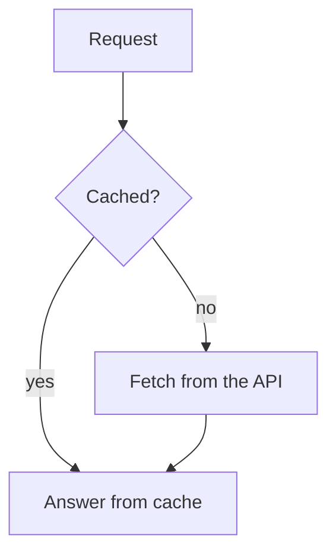

# Diagrams in answers

The person you work for reads your answers in the Boxes dashboard, often on
a phone. The dashboard draws every code block marked `mermaid` as a diagram.

## When to draw

- Draw when the shape of something matters: how parts depend on each other,
  the steps of a flow, who calls whom and in which order, or the states of
  a process.
- Do not draw what a short list or a sentence says just as well.
- Keep to one idea per diagram. Two small diagrams read better than one
  large one, especially on a phone.

## How to write one

Write a fenced code block with the language `mermaid`:

````markdown

````

- `flowchart` covers most needs: dependencies, flows and decisions.
  `sequenceDiagram` shows messages between parts over time. `stateDiagram-v2`
  shows states and their transitions. Other mermaid types work too.
- Prefer `flowchart TD` (top to bottom). A phone screen is narrow, and a long
  chain from left to right becomes too small to read.
- Keep labels short. Put a label with brackets, quotes or other special
  characters in double quotes: `A["parse(input)"]`.
- Do not set a theme. The diagram follows the dashboard's light or dark mode.

## Check the diagram

If the dashboard cannot parse a block, the person sees only the source text.
Before you send a diagram that is not trivial, render it to an image and look
at it. This finds syntax errors and shows if the layout is too wide or
crowded.

Write the source to a file, then render it with the mermaid CLI and the
Chromium of the box:

```bash
mkdir -p /tmp/mermaid
echo '{"args":["--no-sandbox"]}' > /tmp/mermaid/puppeteer.json
# write the diagram source to /tmp/mermaid/diagram.mmd
PUPPETEER_EXECUTABLE_PATH=/usr/local/bin/chromium \
  npx -y @mermaid-js/mermaid-cli -p /tmp/mermaid/puppeteer.json \
  -i /tmp/mermaid/diagram.mmd -o /tmp/mermaid/diagram.png
```

- Chromium crashes without the `--no-sandbox` argument in the puppeteer
  configuration.
- On a syntax error, the command prints the parse error with the line and
  exits with a status that is not zero. Fix the source and render again.
- Open the PNG file to look at the result. Use `-o diagram.svg` to get an
  SVG file instead.

