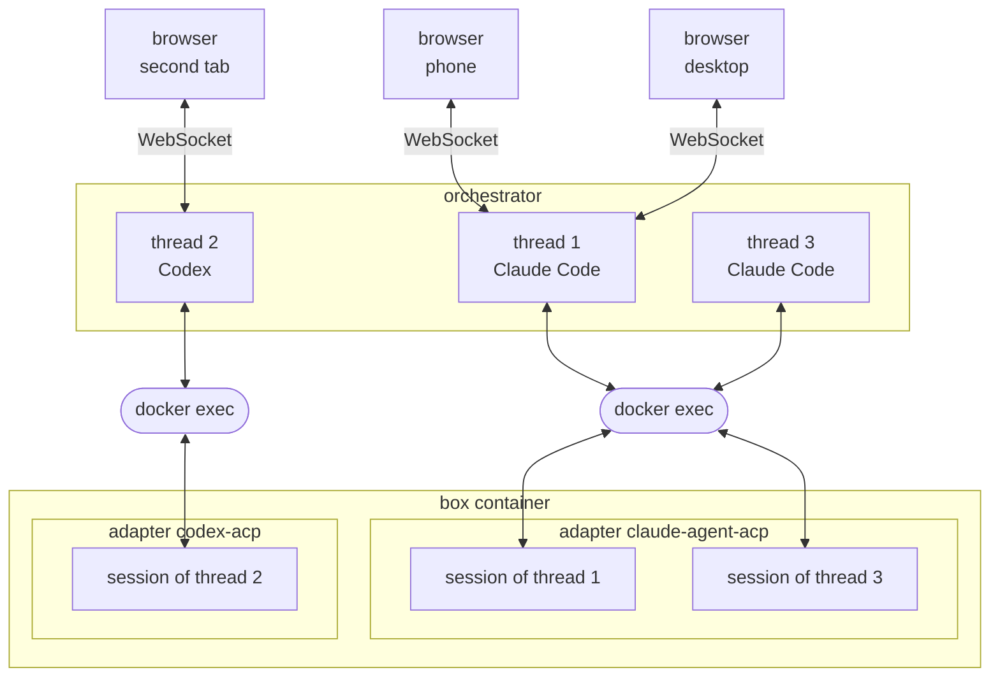

# Agent communication

The dashboard and the agents speak the Agent Client Protocol (ACP), which is built on JSON-RPC. The orchestrator is
between the two. It answers a browser as an ACP agent, and it drives the adapter in a box as an ACP client.

## Threads and sessions

Boxes calls one conversation a [thread](threads.md). The protocol calls it a session, and so does the adapter that holds
it. One thread is therefore one session, and the orchestrator holds the two ends together.

## From a browser to the orchestrator

The dashboard runs in the browser. To show a thread, it opens one WebSocket to the orchestrator and speaks ACP over it.
Two browsers on one thread are two connections, as the phone and the desktop are in the diagram above.

The WebSocket connection is authenticated with a token that the dashboard obtains through the [REST API](rests.md)
before it opens the connection. The token belongs to the box: it is valid for all threads of that box and for its
terminal.

## From the orchestrator to the adapter

An adapter is the process that makes one [harness](glossary.md) available over ACP. It starts the agent, and it
translates between the protocol and that agent. It runs inside the [box container](boxes.md).

The orchestrator starts an adapter with `docker exec` when a thread needs it for the first time. The adapter reads and
writes JSON-RPC messages on the standard input and output of that exec. Its standard error carries log messages.

One exec and one adapter process serve one harness. So all threads of the same harness are sessions in that process. In
the diagram, thread 1 and thread 3 both run in `claude-agent-acp` while thread 2 runs in `codex-acp`. A box with Claude
and Codex threads therefore runs two adapter processes on one workspace.

## The message log

The orchestrator keeps the messages of each thread in its memory. A browser that opens an existing thread for the first
time receives this log from the orchestrator. On later reconnections, it receives only the messages that it does not yet
hold.

The orchestrator log is limited to 4 MiB per thread. Above this size, it drops the oldest messages of the thread. In
that case a user can request the full transcript using the **Load full history** button: the orchestrator then reads the
full transcript from the adapter and passes it through to the dashboard. A thread whose log is complete shows no such
button.

A full transcript can only be requested while the thread is idle.

The orchestrator sends the updates of a thread to every browser that has a connection open to that thread. In the
diagram's example, the orchestrator sends updates of thread 1 to the phone and the desktop — they show the same
messages.

## Permission requests

Some tool calls need the permission of the user. The agent asks for it, and the turn stops until an answer comes back.

The orchestrator sends the question to the browser that was active last on the thread. If nobody watches the thread, the
orchestrator keeps the question and sends a [push notification](notifications.md). A browser that opens the thread
afterwards receives the kept question, and the first answer removes it from the others.

`PERMISSION_HOLD_MINUTES` sets how long a question waits. `PERMISSION_FALLBACK` decides what happens then: `hold` keeps
it waiting, and `deny` refuses the tool call with a refusal that the agent offered, or cancels the tool call when the
agent offered none. Boxes approves no tool call automatically.

## Mode and settings

A mode controls how much an agent does without a question, such as the plan mode of Claude Code or the read-only mode of
Codex. The settings are the other choices that an agent offers, such as the model or thinking effort level. A user
selects both in the new thread dialog and in the thread header.

An adapter forgets the mode and the settings of a session when it stops. The orchestrator therefore records both in its
database, each time the adapter accepts a change and each time the agent changes something itself. It then restores them
when a thread is opened again.

## Adapter restarts

An adapter process ends when its box container is stopped or when it crashes.

The next message for one of its threads starts it again: a user that opens a thread, or a prompt sent on one. The
orchestrator then restores the sessions of the most recently opened thread and of all currently connected threads, and
it applies the recorded mode and settings.

The other threads of the box resume their session when a user opens them.

If an adapter does not start, the orchestrator retries the spawn with backoff. When the last attempt fails, the
[status](status.md) of the box becomes **Error**. Threads of the other harness in the same box continue to run.

## Technical internals

The ACP gateway is the part of the orchestrator that connects the browsers and the adapters. Its code is in
`orchestrator/src/gateway/`.

### Upstream: one adapter connection per harness

`upstream.ts` holds the gateway state of one box: one `AdapterConnection` per harness its threads use (`adapter.ts`),
the attached browsers, the unanswered permission requests, and the probe that reads the container's process table.

The `initialize` handshake advertises one client capability: the async-task extension. The connection keeps the
adapter's `initialize` response and answers each browser's `initialize` with it, so the browser sees the capabilities of
the agent that holds its conversation.

The orchestrator parses the protocol with the ACP SDK (`@agentclientprotocol/sdk`). The SDK accepts only the
`session/update` kinds that its schema defines, and the async-task extension adds kinds outside that schema. The
connection therefore removes the async-task updates from the adapter's output stream before the SDK parses it, and
delivers them itself.

### Downstream: one connection per browser

`downstream.ts` serves the WebSocket connections described above. The upgrade path is
`/ws/boxes/:id/threads/:threadId/acp`; the shorter `/ws/boxes/:id/acp` pins the box's most recently active thread. A
connection stays on its thread for its whole life. ACP requests carry a `sessionId`, and the gateway refuses one that
names a different thread. A path that names a thread of a different box gets a 404 before the socket exists.

The token described above travels as a `bearer.<token>` subprotocol entry beside `acp.v1`, because a browser cannot set
a header on a WebSocket upgrade. The comparison takes constant time, and an upgrade for an unknown box gets the same 401
as a wrong token, so the handshake does not reveal which boxes exist. The gateway disconnects a browser whose send
buffer grows too large, rather than buffering without limit; the reconnected browser resumes from the message log.

`broadcast.ts` routes each update to the browsers of its thread. A forwarded prompt is echoed to every browser of its
thread, the sender included, because an adapter is not required to echo it live.

### The thread log

`thread-log.ts` implements the message log described above. The log starts with the replay the adapter sent when the
thread was brought up, and it grows by everything forwarded live since. A replay and a live turn look the same on the
adapter's wire, so a replay routed to a browser would corrupt a live thread. The gateway therefore answers a
`session/load` from this log, not from the adapter. On a reconnect, the browser names the last message id it holds in
the `_meta.boxes.resumeFrom` field of its `session/load` request; the named message is sent again, because a socket can
drop halfway through one. The `_boxes/replay` notice arrives before the first update and says whether the log resumed
and whether it was truncated.

Eviction drops the oldest message together with all its chunks, so the log always ends and starts at a message boundary.

The full history described above is requested with `_meta.boxes.full` on `session/load` — the one load that reaches the
adapter. The gateway refuses it while another replay runs or while a fork has no transcript of its own, and it sends the
replay to the asking browser only: the replay goes into neither the log nor the other browsers.

### Permission requests

`pending.ts` implements the queue of unanswered requests described above. It keeps each request twice: as an entry in
the `pending_requests` database table, so the dashboard can show the waiting approval, and as an in-memory callback that
resolves the adapter's blocked request. A restart loses the callback, so a stored entry can never be answered after one.
The orchestrator drops the leftover entries when it boots.
