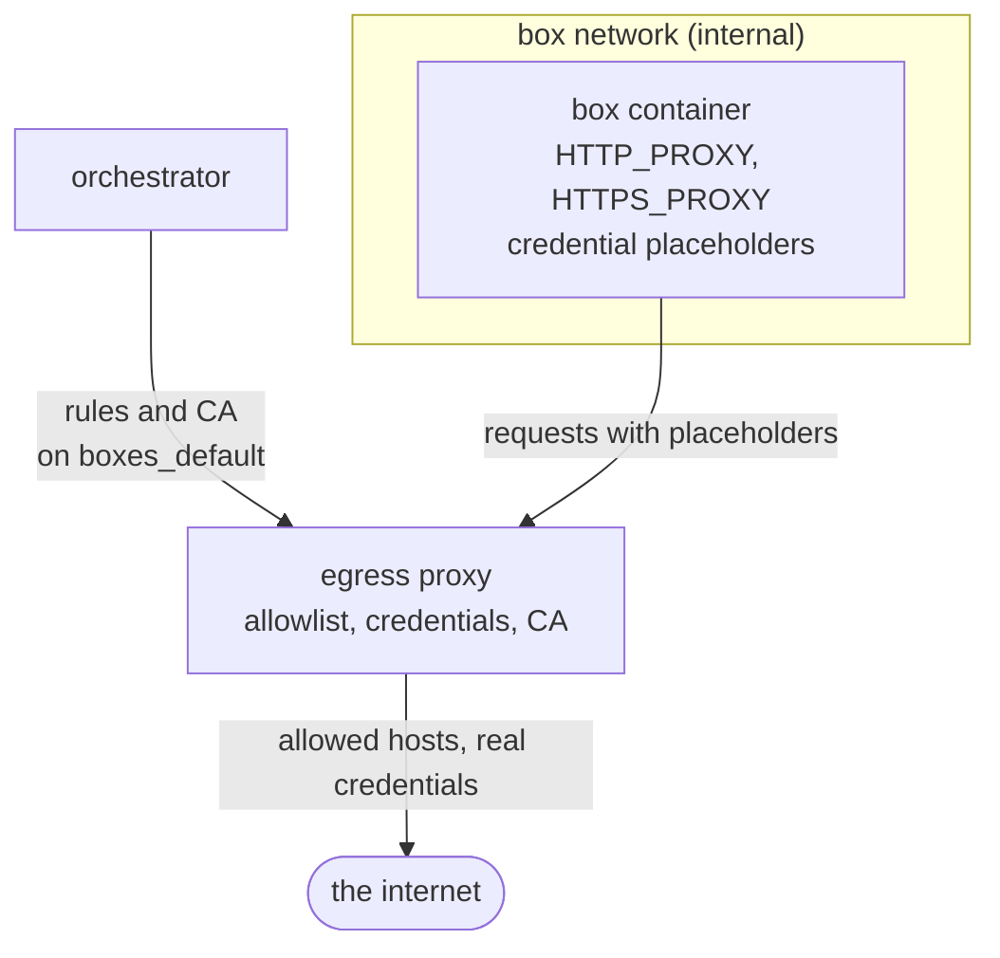

# Egress proxy

Boxes creates a private Docker network for each box, and creates it as an
internal network. Such a network has no route to the outside. The egress proxy
is attached to it, and is the only way out.

The proxy does two things. It controls which hosts the tools in a box can
connect to. It also replaces the credential placeholders in the requests that
go to those hosts. A real credential thus never enters a box container.

The proxy keeps its rules in memory. It has no configuration file and no
database. The orchestrator sends the rules to the proxy at start, and again
after each change to a credential or a setting. Only the Compose network
`boxes_default` can connect to this control channel. The orchestrator and the
proxy share that network, and the box networks have no route to it.



## Network access

The orchestrator sets `HTTP_PROXY` and `HTTPS_PROXY` in the environment of
each box container. Tools that use these variables connect through the proxy.
The proxy allows only port 80 and port 443. All other connections fail,
because the box network has no other route. An agent thus cannot use SSH, and
cannot connect to a database on a remote host.

## Allowlist

`EGRESS_ALLOWED_HOSTS` is an orchestrator environment variable. It holds one
allowlist for the full deployment. Separate the host names with commas or
spaces:

```sh
EGRESS_ALLOWED_HOSTS=github.com, *.npmjs.org, cache.nixos.org, pypi.org
```

A name that starts with `*.` includes one level of subdomains. `*.npmjs.org`
includes `registry.npmjs.org`. It does not include `npmjs.org` or
`a.b.npmjs.org`.

The variable is empty by default. The proxy then allows all public hosts. The
proxy always refuses a private address, also when a public host name has a
private address.

The proxy always allows the hosts of the saved credentials, and the hosts that
the related tools must connect to. A short allowlist thus cannot prevent an
agent from reaching its API, or `git` from reaching its repository.

## Credentials

The orchestrator puts only a placeholder for each credential into the
environment of a box container. The real credentials stay in the credential
store and in the memory of the proxy.

When a user saves a credential on the settings page, the proxy intercepts the
TLS connections to the hosts that accept this credential. It decrypts each
request, examines the credential header, and sends the request on:

- If the header has the placeholder, the proxy rewrites it with the real
  credential.
- If the header has a different value, the proxy refuses the request.
- If the request has no credential header, the proxy sends it unchanged.

The Dev Tunnels credential is an exception to the second rule. The `devtunnel`
CLI in a box sends the placeholder to the Dev Tunnels API, and the proxy
rewrites it with the saved credential as it does for every other credential.
The API answers with a token for that one tunnel, and the CLI then sends this
token under the `tunnel` scheme. The proxy lets such a token through
unchanged, because the service issued it to the box. It is short-lived, it is
valid for one tunnel only, and it cannot give access to the account.

The proxy does not intercept any other host. It only sends that traffic
through, and does not read it.

Each credential is valid for a fixed set of hosts. When a credential is set,
its hosts are added to the list of allowed hosts automatically.

| Credential | Valid hosts |
| --- | --- |
| Claude | `api.anthropic.com` |
| OpenAI | `api.openai.com` |
| GitHub | `github.com`, `api.github.com`, `*.githubusercontent.com` |
| GitLab | `gitlab.com`, or the host in `GITLAB_HOST` |
| Dev Tunnels | `*.rel.tunnels.api.visualstudio.com` |

## The deployment certificate authority

The orchestrator creates a certificate authority one time and stores it in the
data volume. It sends the certificate and the key to the proxy with the rules.
The proxy then creates a certificate for each host that it intercepts.

The orchestrator also sends the certificate to each box container. The
entrypoint of the container writes it to `~/.boxes/proxy-ca.crt`, and writes
it together with the system certificates to `~/.boxes/ca-bundle.crt`. The
environment variables `NODE_EXTRA_CA_CERTS`, `SSL_CERT_FILE`, `GIT_SSL_CAINFO`
and `CURL_CA_BUNDLE` contain the path of that bundle. A tool that uses none
of these variables fails on the intercepted hosts, and works on all other
hosts.

## Settings

[Environment variables](environment.md) describes the ports and the names that
the orchestrator and the proxy use. [Docker Compose setup](compose.md)
describes the network layout.
