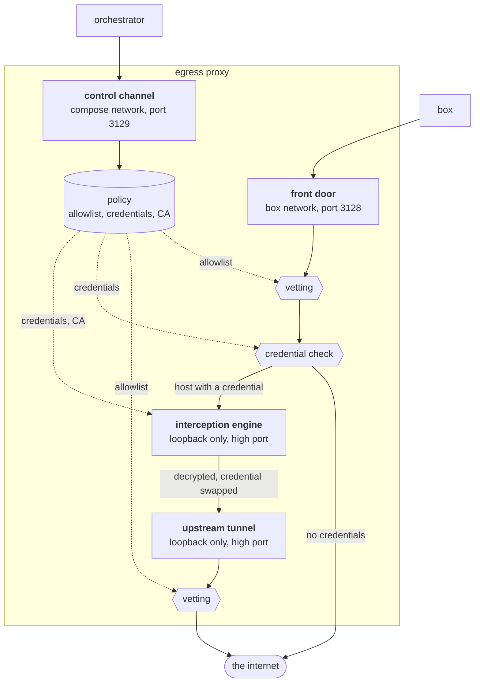

# Egress proxy

Boxes creates a private Docker network for each [box](boxes.md), and creates it as an internal network. Such a network
has no route to the outside. The egress proxy is attached to it, and is the only way out.

The proxy does two things. It controls which hosts the tools in a box can connect to. It also replaces the credential
placeholders in the requests that go to those hosts. A real credential thus never enters a box container.

The proxy keeps its rules in memory. It has no configuration file and no database. The orchestrator sends the rules to
the proxy at start, and again after each change to a credential or a setting. Only the Compose network `boxes_default`
can connect to this control channel. The orchestrator and the proxy share that network, and the box networks have no
route to it.


## Network access

The orchestrator sets `HTTP_PROXY` and `HTTPS_PROXY` in the environment of each box container. Tools that use these
variables connect through the proxy. The proxy allows only port 80 and port 443. All other connections fail, because the
box network has no other route. An agent thus cannot use SSH, and cannot connect to a database on a remote host.

## Allowlist

`EGRESS_ALLOWED_HOSTS` is an orchestrator environment variable. It holds one allowlist for the full deployment. Separate
the host names with commas or spaces:

```sh
EGRESS_ALLOWED_HOSTS=github.com, *.npmjs.org, cache.nixos.org, pypi.org
```

A name that starts with `*.` includes one level of subdomains. `*.npmjs.org` includes `registry.npmjs.org`. It does not
include `npmjs.org` or `a.b.npmjs.org`.

The variable is empty by default. The proxy then allows all public hosts. The proxy always refuses a private address,
also when a public host name has a private address.

The proxy always allows the hosts of the saved credentials, and the hosts that the related tools must connect to. A
short allowlist thus cannot prevent an agent from reaching its API, or `git` from reaching its repository.

## Credentials

The orchestrator puts only a placeholder for each credential into the environment of a box container. The real
credentials stay in the credential store and in the memory of the proxy.

When a user saves a [credential](credentials.md) on the settings page, the proxy intercepts the TLS connections to the
hosts that accept this credential. It decrypts each request, examines the credential header, and sends the request on:

- If the header has the placeholder, the proxy rewrites it with the real credential.
- If the header has a different value, the proxy refuses the request.
- If the request has no credential header, the proxy sends it unchanged.

The Dev Tunnels credential is an exception to the second rule. The `devtunnel` CLI in a box sends the placeholder to the
Dev Tunnels API, and the proxy rewrites it with the saved credential as it does for every other credential. The API
answers with a token for that one tunnel, and the CLI then sends this token under the `tunnel` scheme. The proxy lets
such a token through unchanged, because the service issued it to the box. It is short-lived, it is valid for one tunnel
only, and it cannot give access to the account.

The proxy does not intercept any other host. It only sends that traffic through, and does not read it.

Each credential is valid for a fixed set of hosts. When a credential is set, its hosts are added to the list of allowed
hosts automatically.

| Credential | Valid hosts |
| --- | --- |
| Claude | `api.anthropic.com` |
| OpenAI | `api.openai.com` |
| GitHub | `github.com`, `api.github.com`, `*.githubusercontent.com` |
| GitLab | `gitlab.com`, or the host in `GITLAB_HOST` |
| Dev Tunnels | `*.rel.tunnels.api.visualstudio.com` |

## The deployment certificate authority

The orchestrator creates a certificate authority once and stores it in the [data volume](storage.md). It sends the
certificate and the key to the proxy with the rules. The proxy then creates a certificate for each host that it
intercepts.

The orchestrator also sends the certificate to each box container. The entrypoint of the container writes it to
`~/.boxes/proxy-ca.crt`, and writes it together with the system certificates to `~/.boxes/ca-bundle.crt`. The
environment variables `NODE_EXTRA_CA_CERTS`, `SSL_CERT_FILE`, `GIT_SSL_CAINFO` and `CURL_CA_BUNDLE` contain the path of
that bundle. A tool that uses none of these variables fails on the intercepted hosts, and works on all other hosts.

## Settings

[Environment variables](environment.md) describes the ports and the names that the orchestrator and the proxy use.
[Docker Compose setup](compose.md) describes the network layout.

## Technical internals

The proxy (`proxy/src/`) runs four listeners:

1. control channel: the orchestrator connects to it on the Compose network and sends the rules and the CA.
2. front door: the tools in a box connect to it on the box network and send their requests.
3. interception engine: the front door hands connections to it for the hosts that have a credential. It decrypts the
   request, examines the credential header, and sends the request on.
4. upstream tunnel: the only way out of the engine. The engine connects to it on the loopback.



### Vetting

Vetting is one function, `vetTarget` in `forward.ts`. Each forwarder calls it before it connects, so no socket leaves
the proxy unvetted.

A tunneled host passes vetting one time. The front door vets the destination, and then opens the connection itself.

An intercepted host passes vetting two times, because that path opens two connections. The front door does not connect
to the host; it connects to the engine on the loopback, and the address that it vetted is of no more use. The engine
then makes its own request, and that request leaves through the upstream tunnel. The tunnel vets before it connects, as
every forwarder does.

The front door and the upstream tunnel are the same server code. Only the front door hands connections to the engine.
The tunnel never intercepts, so the connections of the engine cannot loop back into it.

The front door (`forward.ts`) handles plain HTTP with an absolute URI, and CONNECT, on ports 80 and 443 only. It vets a
target in a fixed order: the port, then the allowlist, then the address. The allowlist comes before the DNS lookup, so
the proxy never resolves a denied name. Every resolved address must pass. `cidr.ts` holds the blocked ranges, with the
IPv6 forms that embed an IPv4 address, and input that it cannot parse fails closed.

A forwarder connects to the one address that vetting chose, and does not resolve the name a second time. This closes DNS
rebinding for that connection. On the intercepted path the upstream tunnel gives this protection, because the front door
drops its address when it hands the connection to the engine.

The front door refuses a credential host in the clear: on port 80, and on a CONNECT to a port other than 443. Such a
request has no TLS for the engine to terminate, so the proxy would send either the real credential or the placeholder as
plaintext.

The front door forwards nothing before the first policy push arrives. No policy is a denial, although an empty allowlist
means "allow all public".

### Policy

`policy.ts` implements the allowlist grammar and the credential decision as pure functions, with no I/O and no state.
The intercepted hosts and their credential headers are fixed in `orchestrator/src/config.ts`: they are facts about the
services, and no setting changes them — except the GitLab host, which `GITLAB_HOST` names.

The OpenAI entry is the special case. Codex authenticates with an API key to `api.openai.com` or with a subscription
login to `chatgpt.com`, and the two endpoints reject each other's credential. The proxy intercepts only
`api.openai.com`: `chatgpt.com` is allowed but never intercepted, because an intercepted subscription request would be
refused as a foreign credential. This lets an API key and a subscription login coexist in one box.

### Interception

The interception engine (`inject.ts`, built on the mockttp library) implements the credential decision described above.
It reads only the headers the policy names for a host, and it treats nothing else as a credential. The swap works on the
header value: the engine replaces the placeholder string wherever it appears, so one mechanism covers the `Bearer` and
`token` schemes, a bare value, and the base64 `user:password` pair of HTTP Basic that git's credential helper sends.

The engine listens on all interfaces, so it refuses every peer that is not on the loopback. The front door alone can
reach it, and thus nothing enters the engine that the front door did not vet. The destination also stays what the front
door saw: the engine takes it from the CONNECT that the front door replayed, not from the `Host` header of the decrypted
request.

A protocol upgrade is forwarded with its headers unchanged, so the engine refuses an upgrade that would need a swap.
This is why the box image sets `supports_websockets = false` for Codex: the harness uses HTTPS directly instead of
retrying a refused upgrade.

The engine resolves no name of its own. It sends every request to the upstream tunnel, and the tunnel vets the
destination and opens the socket.

### Control channel

The control channel (`control.ts`) binds to the container's own address on the network that carries the default route.
Box networks install no default route, so this address is on the Compose network — this is how the restriction described
above is enforced. The proxy itself is not configured with a token: the first push claims the channel with the bearer it
presents, and the proxy refuses every later call that presents a different one.

The orchestrator side (`orchestrator/src/egress.ts`) generates the CA and that token once, and stores them in the
database. A placeholder is generated when a credential is stored, and is kept with it. A restarted proxy has lost the
policy, so the reconciler pushes it again every minute.
